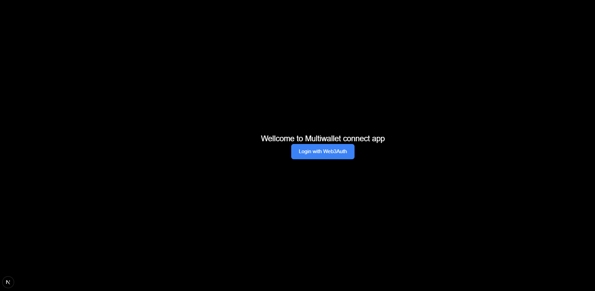
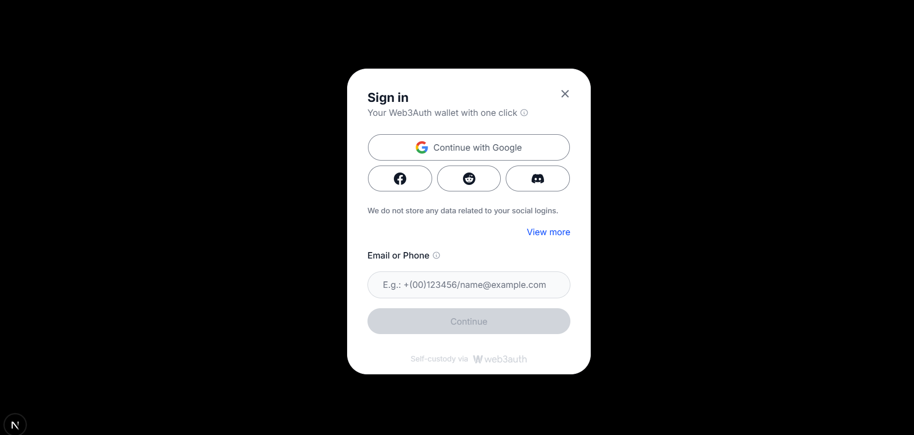
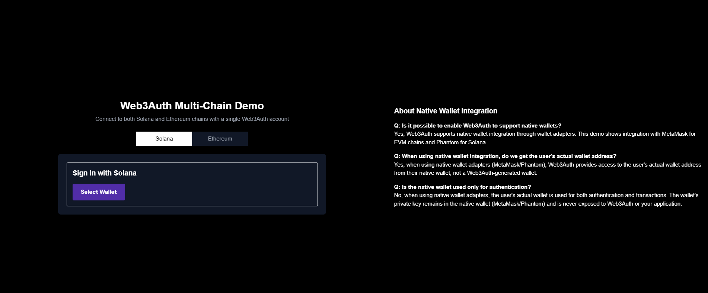
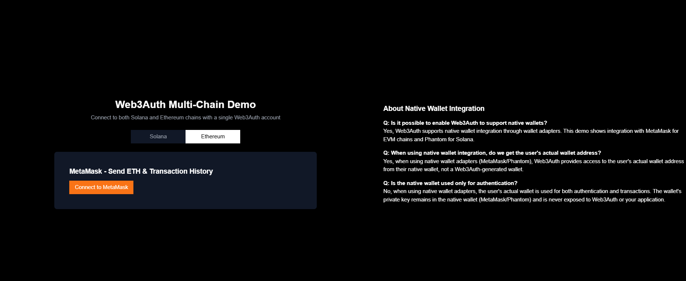
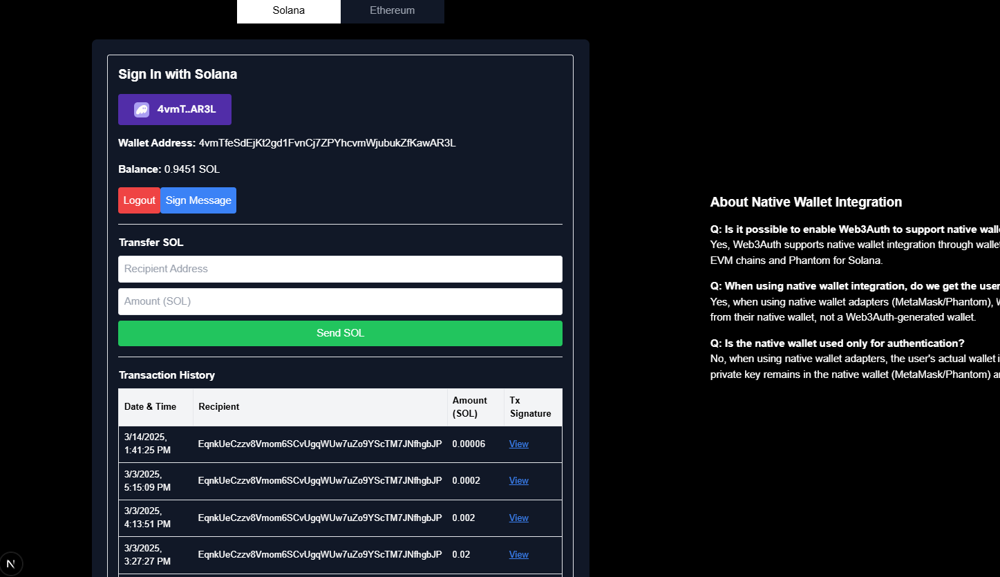

This is a [Next.js](https://nextjs.org) project bootstrapped with [`create-next-app`](https://nextjs.org/docs/app/api-reference/cli/create-next-app).

## Getting Started

First, run the development server:

```bash
npm run dev
# or
yarn dev
# or
pnpm dev
# or
bun dev
```

Open [http://localhost:3000](http://localhost:3000) with your browser to see the result.

You can start editing the page by modifying `app/page.tsx`. The page auto-updates as you edit the file.

This project uses [`next/font`](https://nextjs.org/docs/app/building-your-application/optimizing/fonts) to automatically optimize and load [Geist](https://vercel.com/font), a new font family for Vercel.

## Learn More

To learn more about Next.js, take a look at the following resources:

- [Next.js Documentation](https://nextjs.org/docs) - learn about Next.js features and API.
- [Learn Next.js](https://nextjs.org/learn) - an interactive Next.js tutorial.

You can check out [the Next.js GitHub repository](https://github.com/vercel/next.js) - your feedback and contributions are welcome!

## Deploy on Vercel

The easiest way to deploy your Next.js app is to use the [Vercel Platform](https://vercel.com/new?utm_medium=default-template&filter=next.js&utm_source=create-next-app&utm_campaign=create-next-app-readme) from the creators of Next.js.

Check out our [Next.js deployment documentation](https://nextjs.org/docs/app/building-your-application/deploying) for more details.


[ Start ] --> [ User logs in using Web3Auth ] 
               |
               v
   [ Dashboard with options: ]
        |                   |
        v                   v
[ Connect Solana ]     [ Connect EVM ]
        |                   |
        v                   v
[ Solana Wallet Connected ] [ EVM Wallet Connected ]
        |                   |
        v                   v
[ Send Transaction ]     [ Send Transaction ]
        |                   |
        v                   v
[ Transaction Mined ]   [ Transaction Mined ]
        |                   |
        v                   v
[ View Transaction History ]<--------------|
            
Landing Page
➡️ User sees the navbar with "Connect Wallet" and "Logout" buttons.

Login with Web3Auth
➡️ User clicks "Connect Wallet" → Opens Web3Auth popup.
➡️ User chooses login provider (Google, Twitter, etc.).
➡️ Web3Auth creates a session. then it will redirect to dashboard

Wallet Selection
➡️ After login, user sees two options:

Connect Solana Wallet (Web3Auth or Phantom)
Connect EVM Wallet (Web3Auth or MetaMask)
➡️ User connects one or both wallets.


Transaction
➡️ User initiates a transaction on the connected wallet.
➡️ If successful:
✅ Transaction is mined and added to the blockchain.
➡️ If failed:
❌ Error message is shown.

Transaction History
➡️ User can view transaction history for both Solana and EVM.
